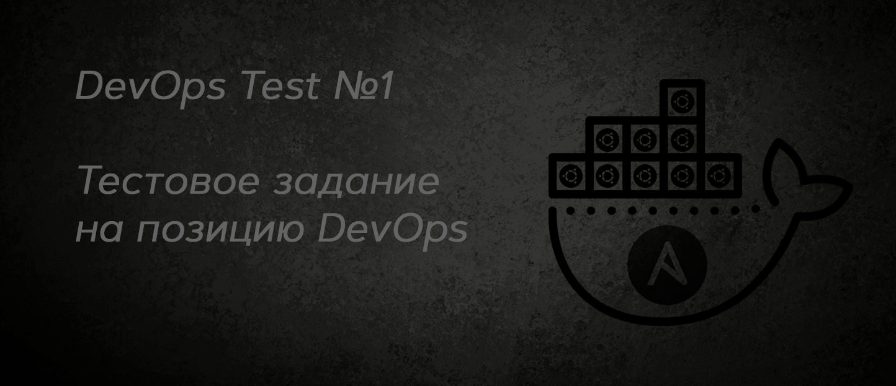

## Введение
Тестовое задание на позицию DevOps Junior


## Содержание
- [Введение](#введение)
- [Содержание](#содержание)
- [Цель](#цель)
- [Структура](#структура)
- [Примечания](#примечания)
- [Запуск](#запуск)
- [Документация](#документация)
- [Запуск и инициализация базы данных](#запуск-и-инициализация-базы-данных)
- [Проверка качества кода](#проверка-качества-кода)
	- [Использование pre-commit](#использование-pre-commit)
	- [Использование ansible-lint](#использование-ansible-lint)
- [Участие](#участие)
- [Лицензия](#лицензия)


## Цель
```markdown
Разработать Ansible плейбук для автоматического развертывания докеризированного веб-приложения, состоящего из **Nginx, PHP и MySQL**, на удалённом сервере с использованием `docker-compose.yml`.

Плейбук должен решать следующие задачи:
1. Дистрибуция необходимых файлов:
	- Копировать все необходимые файлы приложения на удалённый сервер
2. Генерация конфигурационного файла для Nginx:
	- Создавать конфигурационный файл для Nginx
	- При необходимости перезапускать Nginx для применения изменений

Результатом выполнения ТЗ является:
1. Ansible playbook (вместе с ролями и/или файлом с зависимостями, необходимыми шаблонами)
2. docker-compose.yml
3. Dockerfile
```


## Структура
```text
├── README.md
├── ansible.cfg
├── inventories
│   └── inventory.ini
├── playbooks
│   └── playbook.yml
└── roles
   ├── docker_compose
   │   ├── defaults
   │   │   └── main.yml
   │   ├── files
   │   │   ├── Dockerfile
   │   │   ├── docker-compose.yml
   │   │   ├── init.sql
   │   │   └── .env
   │   ├── handlers
   │   │   └── main.yaml
   │   ├── meta
   │   │   └── main.yaml
   │   ├── src
   │   │   └── index.php
   │   └── tasks
   │       └── main.yaml
   ├── nginx
   │   ├── defaults
   │   │   └── main.yml
   │   ├── handlers
   │   │   └── main.yaml
   │   ├── meta
   │   │   └── main.yaml
   │   ├── tasks
   │   │   └── main.yaml
   │   └── templates
   │       └── nginx.conf.j2
   └── preconfig
       ├── handlers
       │   └── main.yaml
       ├── meta
       │   └── main.yaml
       └── tasks
           └── main.yaml
```

## Примечания
- Роль под Linux/Debian
- При первом запуске плейбука может потребоваться установка необходимых пакетов на сервере, что займет некоторое время


## Запуск
1. Отредактируйте файл `ansible/inventory.ini`, указав IP-адрес вашего удалённого сервера, имя пользователя и порт
2. Убедитесь, что запущена ВМ c проброшенными портами для подключения по ssh
3. Убедитесь, что ssh-доступ под ansible_user настроен корректно
4. Создайте `.env` файл в `roles/docker_compose/files/` и укажите там ваши секреты
5. Запустите Ansible плейбук с помощью команды: `ansible-playbook -i inventories/inventory.ini playbooks/playbook.yml -K` и введите пароль
6. После завершения плейбука, приложение будет доступно на порту `8080`, для проверки используйте `curl http://localhost:8080` на ВМ

	<details>
	<summary>Шаблон для создания .env файла</summary>
	</p>

	```
	MYSQL_ROOT_PASSWORD=
	MYSQL_DATABASE=
	```
	</p>
	</details>

	<details>
	<summary>Пример вывода curl</summary>
	</p>

	```bash
	~$ curl http://localhost:8080
	<p>Сегодня 01-10-2024 02:17:20</p>
	<h1>Тут может быть ваша реклама</h1>
	```
	</p>
	</details>


## Документация
Для сборки документации использован сервис `mkdocs`
Вы можете собрать статические файлы c `mkdocs build`, документация соберётся в папке `site`
Посмотреть документацию можно командой `mkdocs serve` и открыть страничку в браузере
<details>
<summary>Пример вывода документации</summary>
</p>


</p>
</details>


## Запуск и инициализация базы данных
Роль `docker_compose` в том числе инициализирует базу данных, проверить её состояние можно на удалённом сервере.

<details>
<summary>Проверка существования базы данных и таблицы</summary>
</p>

Когда контейнеры запустились можно вручную проверить так, выполнив команды на удалённом сервере:
```bash
docker exec -it db mysql -u root -p # и ввести пароль
SHOW TABLES;
DESCRIBE app_table;
```
</p>
</details>

<details>
<summary>Пример вывода</summary>
</p>

```bash
user@ubuntu-server:~/php_app$ docker exec -it db mysql -u root -p
mysql> SHOW TABLES;
+--------------------+
| Tables_in_database |
+--------------------+
| app_table          |
+--------------------+
1 row in set (0.00 sec)

mysql> DESCRIBE app_table;
+---------+---------------------+------+-----+---------+----------------+
| Field   | Type                | Null | Key | Default | Extra          |
+---------+---------------------+------+-----+---------+----------------+
| id      | bigint(20) unsigned | NO   | PRI | NULL    | auto_increment |
| content | text                | NO   |     | NULL    |                |
| status  | text                | NO   |     | NULL    |                |
+---------+---------------------+------+-----+---------+----------------+
3 rows in set (0.00 sec)
```
</p>
</details>


## Проверка качества кода
- **ansible-lint**: проверяет код на соответствие лучшим практикам Ansible
- **yamllint**: проверяет синтаксис и стиль YAML-файлов
- **pre-commit**: автоматически запускает линтеры перед каждым коммитом

### Использование pre-commit
Для начала работы с `pre-commit`, убедитесь, что у вас установлен Python и pip, а также инициализирован git.

Затем выполните следующие команды в корне вашего проекта:
1. Установите `pre-commit`
2. Проверьте наличие файла `.pre-commit-config.yaml` в корне проекта
3. Инициализируйте `pre-commit` командой `pre-commit install`

Теперь каждый раз, когда вы попытаетесь сделать коммит, `pre-commit` автоматически запустит указанные хуки, проверяя ваш код на наличие ошибок и несоответствий стилю, в соответствии с правилами, прописанными в `.pre-commit-config.yaml`


### Использование ansible-lint
`ansible-lint` — это утилита, которая помогает поддерживать код Ansible чистым и последовательным, проверяя его на соответствие стандартам и лучшим практикам.

Чтобы использовать `ansible-lint` в вашем проекте, выполните следующие шаги:
1. Установите `ansible-lint`
2. Запустите `ansible-lint` для проверки ваших playbook и ролей `ansible-lint roles/`

Если вы хотите изменить правила линтинга, отрегулируйте файл `.ansible-lint` в корне вашего проекта. Этот файл позволяет настроить критерии, которые `ansible-lint` будет использовать для проверки вашего кода.

Файл `.ansible-lint-ignore` используется для указания исключений из правил линтинга. Вы можете добавить пути к файлам или шаблонам, которые должны быть проигнорированы `ansible-lint`.

Использование `ansible-lint` поможет вам поддерживать высокое качество кода в вашем проекте Ansible, обеспечивая соблюдение стандартов и лучших практик.


## Участие
Если вы обнаружили какие-либо проблемы или у вас есть предложения по улучшению, пожалуйста, создайте новый `issue` или отправьте `pull request`.


## Лицензия
Этот проект лицензирован [MIT License](LICENSE).
